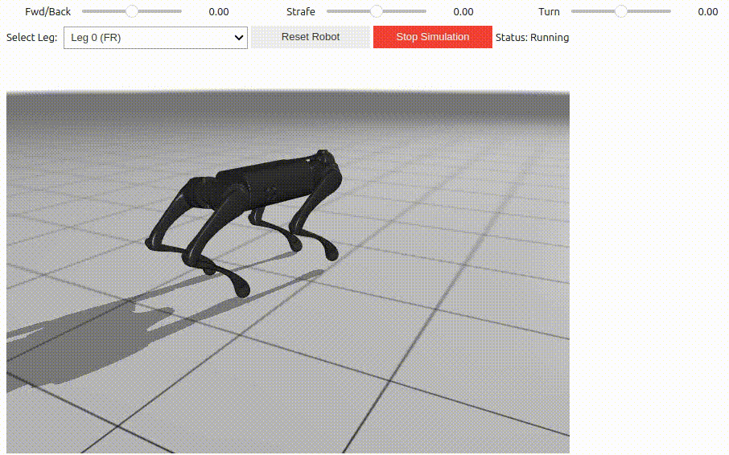

# Hurt Paw - Quadruped Locomotion Training

A reinforcement learning project for training a quadruped robot (Unitree Go1) to walk with an injured leg. It can switch between front legs. Walking without the "hind legs" seems to be more difficult to learn possibly due to CoM being placed closer to the hind legs.

You should be able to run it with a reasonable GPU (30xx and 8GB VRAM)

## Overview

This project trains a robot to maintain locomotion capabilities when one of its legs is hurt and should avoid ground contact. The robot learns to adapt its gait to compensate for the injured limb while following velocity commands.

## Features

- **Custom reward system** that penalizes contact with the injured leg
- **Curriculum learning** approach that progressively increases task difficulty
- **Interactive simulation** with adjustable velocity commands and leg selection
- **Domain randomization** for sim-to-real transfer robustness

## Training

The training uses PPO (Proximal Policy Optimization) with the Brax framework and MuJoCo physics simulation. The curriculum trains the robot in phases, gradually increasing complexity.

Trained model checkpoints are saved in the `checkpoints/` directory.

## Requirements

Any environment that runs the original mujoco playground notebooks should work.

- JAX
- MuJoCo / MJX
- Brax
- mujoco_playground
- ipywidgets (for interactive simulation)

## Usage

Run the `hurt_paw_training.ipynb` notebook to:
1. Train the policy from scratch
2. Visualize rollouts and performance metrics
3. Use the interactive simulator to test different commands and injured legs

